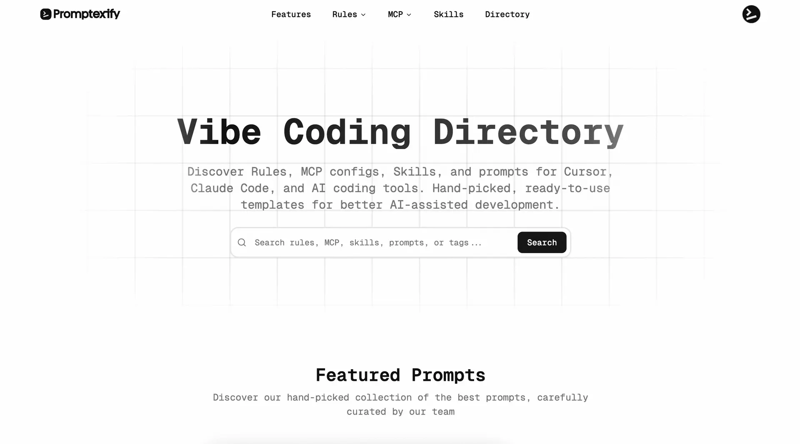
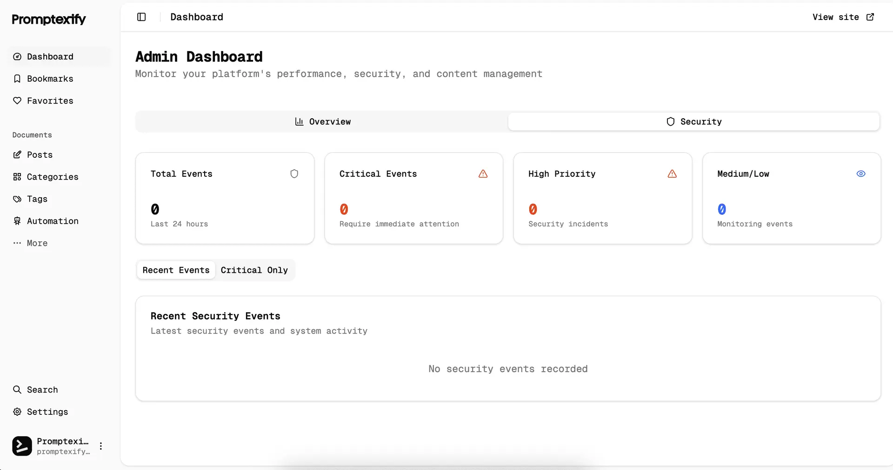

# Promptexify

**Directory for the New Coding Era.**

A curated directory of Rules, MCP configurations, Skills, and prompts built for AI coding tools like Cursor and Claude Code. Copy, paste, and go.

## Demo

| Directory | Admin Dashboard |
|-----------|----------------|
|  |  |

## What is Promptexify?

Promptexify is a community-driven prompt marketplace for vibe coders — developers who build with AI. Instead of writing prompts from scratch, you discover, copy, and share ready-to-use templates optimized for AI coding workflows.

- **Rules** — Project and editor rules for Cursor, Claude Code, and more
- **MCP Configurations** — Ready-to-use Model Context Protocol setups
- **Skills** — Reusable AI skill definitions
- **Prompts** — Tested, copy-paste-ready prompts for everyday coding tasks

> Prompts can generate inaccurate results. Always review output before using in production.

## Features

- **Searchable Library** — Full-text search across titles, descriptions, tags, and categories
- **Copy-Paste Ready** — No modifications needed; prompts work out of the box
- **Categories & Tags** — Hierarchical organization for quick discovery
- **User Authentication** — Sign in with Google or email via Supabase Auth
- **Personal Collections** — Save and organize your favorite prompts
- **Community Contributions** — Share your own prompts with the community
- **Content Moderation** — Draft/approval workflow to maintain quality
- **Admin Dashboard** — Full content and user management interface
- **Free to Use** — No payments, no subscriptions, no paywalls
- **Background Automation** — CSV → posts pipeline via BullMQ + Redis
- **Flexible Storage** — AWS S3, DigitalOcean Spaces, or local filesystem

## Tech Stack

| Layer | Technology |
|-------|-----------|
| Framework | Next.js 15 (App Router, Turbopack), React 18 |
| Database | PostgreSQL + Drizzle ORM |
| Auth | Supabase Auth |
| Styling | Tailwind CSS + Shadcn UI |
| Queue | BullMQ + Redis (in-memory fallback) |
| Storage | AWS S3 / DigitalOcean Spaces / Local |
| Security | CSP nonces, CSRF tokens, rate limiting, audit logs |

## Getting Started

### Prerequisites

- Node.js 20+
- Supabase project (PostgreSQL + Auth)
- Redis (optional in dev — in-memory fallback available)
- AWS S3 or DigitalOcean Spaces (optional — configured via Admin Dashboard, not env vars)

### Setup

1. **Clone the repository**

   ```bash
   git clone https://github.com/chhayvoinvy/promptexify.git
   cd promptexify
   ```

2. **Install dependencies**

   ```bash
   npm install
   ```

3. **Configure environment variables**

   ```bash
   cp env.template .env.local
   # Fill in your Supabase, database, and Redis credentials
   ```

   > **Storage credentials** (AWS S3 / DigitalOcean access keys) are entered through the Admin Dashboard and stored encrypted in Supabase Vault — do not put them in `.env.local`.

4. **Set up the database**

   ```bash
   npm run db:migrate   # Apply migrations
   npm run db:seed      # Optional: seed sample data
   ```

5. **Start the development server**

   ```bash
   npm run dev
   ```

   Open [http://localhost:3000](http://localhost:3000).

   For content automation (background jobs), start the worker in a separate terminal:

   ```bash
   npm run worker
   ```

### Environment Variables

See `env.template` for the full list. Key variables:

| Variable | Description |
|----------|-------------|
| `DATABASE_URL` | PostgreSQL connection string |
| `NEXT_PUBLIC_SUPABASE_URL` | Supabase project URL |
| `NEXT_PUBLIC_SUPABASE_ANON_KEY` | Supabase anon key |
| `REDIS_URL` | Redis connection (optional in dev) |
| `DATABASE_POOLER_MODE` | Set to `transaction` when using Supabase connection pooler |

**No storage environment variables are required.** All storage configuration — provider, bucket, region, and credentials — is managed through the Admin Dashboard (`/dashboard/settings`). Credentials are stored encrypted in Supabase Vault. When no settings row exists yet, the app defaults to local filesystem storage.

## Scripts

| Command | Description |
|---------|-------------|
| `npm run dev` | Start dev server (Turbopack) |
| `npm run build` | Build for production (runs DB migrations first) |
| `npm start` | Start production server |
| `npm run db:migrate` | Apply pending migrations |
| `npm run db:generate` | Generate migration from schema changes |
| `npm run db:push` | Push schema directly (dev only) |
| `npm run db:studio` | Open Drizzle Studio GUI |
| `npm run db:seed` | Seed the database |
| `npm run worker` | Start BullMQ worker |
| `npm run content:generate` | Run CSV → posts automation |
| `npm run lint` | Run ESLint |
| `npm run lint:fix` | Auto-fix ESLint issues |
| `npm run lint:format` | Format with Prettier |

## Architecture

### Request Flow

```
Request
  → Middleware (Supabase session, CSP nonce, CSRF validation, rate limiting)
  → Route Handler / Server Action
  → Drizzle ORM → PostgreSQL
```

### Route Groups

```
app/
  (auth)/           # Public auth pages: signin, signup
  (main)/           # Public site: home, directory, entry/[id]
    @modal/         # Parallel route: post preview modal
  (protected)/      # Authenticated routes
    dashboard/      # Posts, stars, settings
  api/              # REST endpoints: posts, admin, upload, webhooks, etc.
```

### Key Directories

```
├── app/                  # Next.js App Router pages and layouts
├── components/           # React components
├── actions/              # Server actions (CSRF-protected)
├── lib/
│   ├── db/               # Drizzle ORM: schema.ts, migrations, db client
│   ├── security/         # CSP, CSRF, sanitize, audit logging
│   ├── auth.ts           # getCurrentUser, requireAuth, requireAdmin
│   ├── cache.ts          # unstable_cache + Redis/memory fallback
│   └── query.ts          # PostQueries, MetadataQueries
├── drizzle/              # SQL migrations + snapshots
├── middleware.ts         # Session, CSP, CSRF, rate limiting
└── scripts/
    ├── deploy-db.ts      # Production DB deploy (migrations + RLS + indexes)
    └── worker.ts         # BullMQ worker (CSV → posts pipeline)
```

### Database & Deployment

`npm run build` automatically runs `scripts/deploy-db.ts` before the Next.js build:

1. Runs all pending Drizzle migrations
2. Applies RLS helper functions
3. Applies performance indexes and search vector triggers

Schema changes deploy automatically on every production build — no manual migration step needed.

## Security

- **CSP** — Per-request nonces via middleware; passed to components via `x-nonce` header and `csp-nonce` cookie
- **CSRF** — Token validated by middleware for all mutating calls; server actions wrapped with `withCSRFProtection()`
- **Rate Limiting** — Redis-backed with in-memory fallback; scoped limits per route type
- **Input Sanitization** — Applied before all DB writes via `lib/security/sanitize.ts`
- **Audit Logging** — Security events logged to the `logs` table
- **Row-Level Security** — Postgres RLS policies enforced at the database level
- **Supabase Vault** — Storage credentials (S3/DO access keys) encrypted at rest via `pgsodium`; never stored in plaintext

## Contributing

Contributions are welcome! Open an issue to discuss ideas or submit a pull request.

## License

MIT
